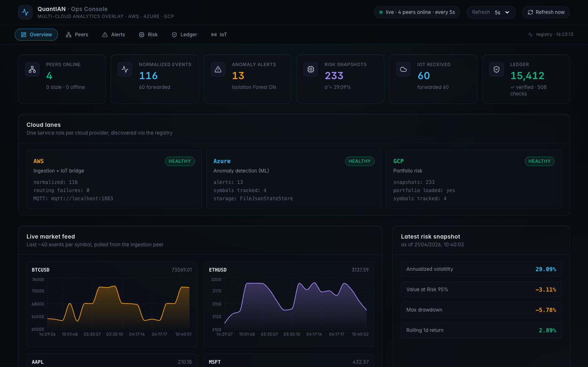
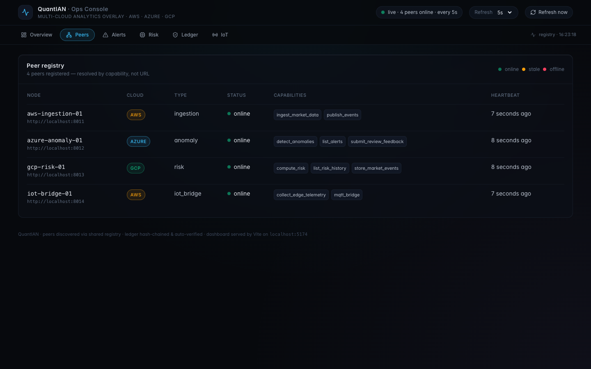
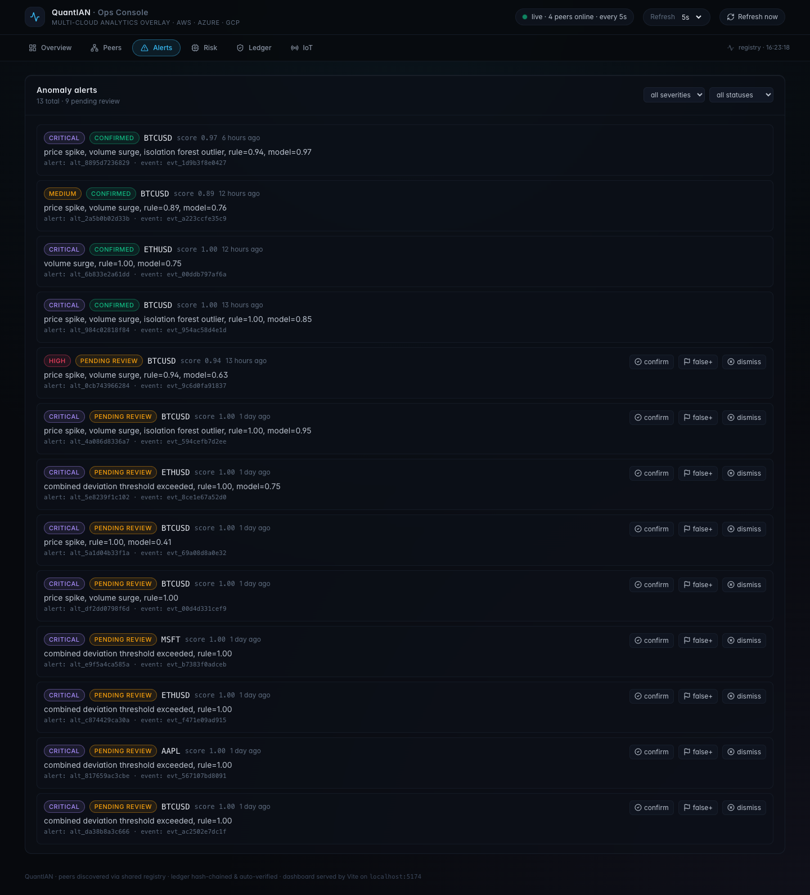
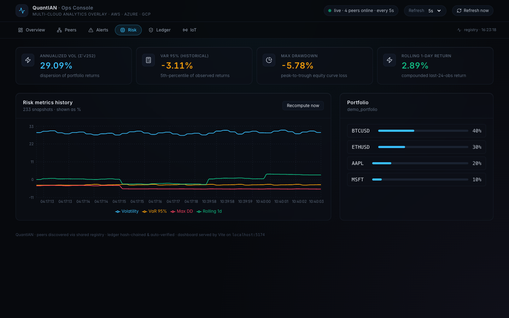
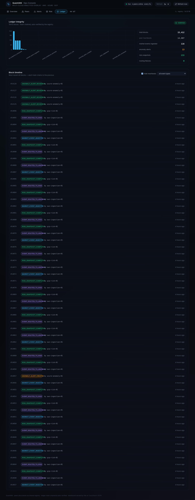
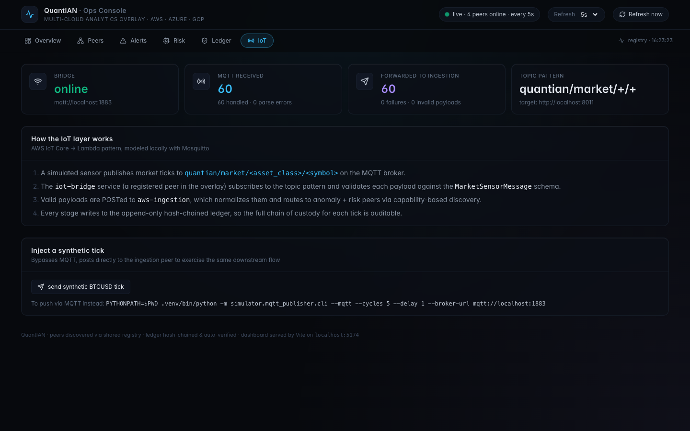

# QuantIAN · Cross-Cloud Market Analytics

[](https://github.com/bhaveshgupta01/CrossCloudAnalyser/actions/workflows/ci.yml)


QuantIAN is a multi-cloud, peer-to-peer financial analytics platform built for the
**NYU Cloud Computing course** (csci-ga.3033-026, Prof. Franchitti). Four
independent services running on AWS, Azure, and GCP discover each other at
runtime through a shared registry, process a simulated market data feed, and
record every cross-peer action in an append-only hash-chained ledger.

**Everything you see in the dashboards is real — no mocks.** Ticks are generated by a
local simulator, published over MQTT, subscribed by the IoT bridge, normalized by
the AWS peer, scored for anomalies by the Azure peer (rule-based **+ Isolation
Forest**), aggregated into risk snapshots by the GCP peer (volatility / VaR 95% /
max drawdown / rolling return), and written block-by-block to the ledger.



---

## Rubric coverage (the 4 required pillars)

| Pillar | Implementation | Where |
|---|---|---|
| **Multi-cloud PaaS** | AWS EC2 + Azure Container Apps + GCP Compute, provisioned by `scripts/cloud_deploy.py` (1,276 lines of real IaC-via-CLI) | `infra/`, `scripts/cloud_deploy.py` |
| **Machine Learning** | scikit-learn `IsolationForest` + rule-based statistical scoring (hybrid) | `azure_anomaly/service.py` |
| **IoT** | MQTT topics `quantian/market/<asset_class>/<symbol>` on Mosquitto; IoT bridge subscribes via `paho-mqtt` and forwards to the ingestion peer | `iot/`, `simulator/mqtt_publisher/` |
| **P2P / Blockchain** | Supernode registry + peer discovery + heartbeats; append-only SHA-256 hash-chained ledger with auto-verification | `registry_service/`, `docs/P2P_OVERLAY.md` |

---

## The story of one price tick

```
   ┌─────────────────────┐
   │ simulated sensor    │  random walk (+ optional anomaly injection)
   │ MarketSensorSimulator│
   └──────────┬──────────┘
              │  publish to  quantian/market/crypto/BTCUSD
              ▼
   ┌─────────────────────┐
   │ Mosquitto MQTT broker│
   │       :1883          │
   └──────────┬──────────┘
              │  QoS 1 json payload
              ▼
   ┌─────────────────────┐   capability: collect_edge_telemetry, mqtt_bridge
   │ IoT Bridge (AWS)    │   registers with registry on startup
   │       :8014         │
   └──────────┬──────────┘
              │  POST /ingestion/messages
              ▼
   ┌─────────────────────┐   capability: ingest_market_data, publish_events
   │ AWS Ingestion       │   normalizes → MarketEvent, asks registry
   │       :8011         │   "who can detect anomalies / store events / compute risk?"
   └──┬───────────────┬──┘
      │               │
   POST /anomaly/     POST /risk/events  and  POST /risk/compute
   analyze            │
      │               ▼
      │        ┌─────────────────┐    capability: compute_risk, store_market_events
      │        │ GCP Risk (:8013)│    appends MarketEvent to symbol series,
      │        │                 │    computes volatility / VaR 95% / max DD / 1d return
      │        └─────────────────┘
      ▼
┌──────────────────────┐     capability: detect_anomalies, submit_review_feedback
│ Azure Anomaly (:8012)│     rule-based score + Isolation Forest score,
│                      │     max(rule, model) → AnomalyAlert if ≥ 0.82
└──────────────────────┘
```

Every arrow above also writes a **LedgerBlock** on the registry (port 8010). A
background task re-walks the chain every 60 seconds and self-records a
`ledger_verification_failed` block if any earlier block was tampered with.

---

## What runs where

| Port | Process | What it is | Ownership |
|------|---------|-----------|-----------|
| 8010 | Registry + Ledger | Phonebook + tamper-evident log | peers list + all blocks |
| 8011 | AWS Ingestion | Market event normalization + capability-based routing | normalized events |
| 8012 | Azure Anomaly | Rule-based + Isolation Forest scoring | alerts + feature history |
| 8013 | GCP Risk | Portfolio risk metrics | portfolio + snapshots |
| 8014 | IoT Bridge | MQTT → HTTP bridge (AWS IoT Core-style) | counters |
| 1883 | Mosquitto | MQTT broker | just forwards |
| 8502 | Streamlit dashboard | Simple operator view | read-only |
| 5174 | **React + Vite dashboard** | Industrial ops console | read-only |

---

## Project structure

```
CrossCloudAnalyser/
├── registry_service/        # supernode: peer registration, capabilities, ledger
├── aws_ingestion/           # AWS peer: normalize + route events
├── azure_anomaly/           # Azure peer: rule-based + IsolationForest
├── gcp_risk/                # GCP peer: volatility / VaR / drawdown / rolling return
├── iot/                     # MQTT bridge (new: IoT pillar)
├── simulator/
│   └── mqtt_publisher/      # MarketSensorSimulator + CLI (--mqtt / stdout)
├── shared/
│   ├── schemas/             # Pydantic contracts (PeerRegistration, MarketEvent, ...)
│   ├── runtime/             # ServiceRuntime: registration, heartbeats, retry-aware routing
│   ├── storage/             # File + Azure Blob JSON state store adapters
│   └── utils/               # hashing, ids, ledger, time
├── dashboard/               # Streamlit dashboard (operator)
├── web_dashboard/           # React + Vite + Tailwind industrial dashboard
├── tests/                   # pytest suite (26 tests)
├── scripts/
│   ├── setup.sh             # one-shot bootstrap (python + node + smoke tests)
│   ├── run_local_stack.py   # launches all services locally
│   ├── service_smoke_test.py # end-to-end integration smoke test
│   ├── cloud_deploy.py      # multi-cloud provisioning (AWS + Azure + GCP)
│   ├── publish_simulation.py # pumps simulated market traffic into ingestion
│   └── capture_screenshots.mjs # Puppeteer-based dashboard screenshotter
├── docs/
│   ├── MASTER_TECHNICAL_DOCUMENT.md         # full design / scope / schemas
│   ├── LIVE_IMPLEMENTATION_TECHNICAL_DOCUMENT.md  # deployed state evidence
│   ├── P2P_OVERLAY.md                       # the P2P pillar explained
│   ├── screenshots/                         # PNGs embedded in this README
│   └── diagrams/                            # draw.io sources
├── infra/vm/                # bootstrap script for AWS/GCP VMs
├── .github/workflows/       # CI: pytest + web typecheck + production build
├── Makefile                 # common dev commands (`make help`)
├── .env.example             # documented environment variables
├── requirements.txt         # Python dependencies
├── pytest.ini
└── .gitignore
```

---

## Prerequisites

- **Python 3.11+** (tested on 3.13)
- **Node.js 20+** and **npm 10+** (for the web dashboard; tested on Node 25)
- **Mosquitto** MQTT broker (`brew install mosquitto` on macOS)
- Optional: `gh` CLI, Docker, AWS/Azure/GCP CLIs (only if deploying to cloud)

---

## Local setup — full stack in under 5 minutes

### The fastest path — no Docker (native Python + Node)

```bash
git clone https://github.com/bhaveshgupta01/CrossCloudAnalyser.git
cd CrossCloudAnalyser
bash scripts/setup.sh           # creates .venv, installs deps, smoke tests
make stack                      # starts broker + 5 peers + streamlit
# in another terminal:
make dashboard                  # React dashboard on :5174
make push-ticks                 # drive 10 MQTT cycles through the pipeline
```

Then open **http://localhost:5174**.

### Alternative — everything in Docker (no Python/Node required on host)

Requires Docker Desktop or Docker Engine with the Compose plugin.

```bash
git clone https://github.com/bhaveshgupta01/CrossCloudAnalyser.git
cd CrossCloudAnalyser

# core stack only (mosquitto + 5 peers)
make docker-up

# core stack + both dashboards (streamlit + nginx-served React)
make docker-up-ui

make docker-logs                # tail everything
make docker-down                # stop and remove (keeps volumes)
```

With `docker-up-ui`, dashboards appear at:

- http://localhost:5174 — React/Vite dashboard (served by nginx inside Docker)
- http://localhost:8501 — Streamlit dashboard

Push some ticks to exercise the stack:

```bash
PYTHONPATH=$PWD python -m simulator.mqtt_publisher.cli \
  --mqtt --cycles 10 --delay 1 --broker-url mqtt://localhost:1883
```

(or run the simulator from inside a container with
`docker compose run --rm registry python -m simulator.mqtt_publisher.cli --mqtt ...`)

### Makefile reference

```bash
make help         # list all targets
make setup        # first-time setup (python + node)
make stack        # start broker + all services (with IoT bridge + streamlit)
make stack-no-iot # start 4 core services only (skip broker + iot-bridge)
make dashboard    # run React/Vite dev server on :5174
make push-ticks   # publish 10 cycles of MQTT market data
make test         # run pytest suite
make typecheck    # typecheck web dashboard
make build        # production build of web dashboard
make status       # health-check all 5 peers
make screenshots  # capture docs/screenshots/*.png from the running dashboard
make stop         # kill every QuantIAN listener + broker
make clean        # stop + wipe runtime state and caches
```

### Manual setup (step by step)

#### 1. Clone & install Python deps

```bash
git clone https://github.com/bhaveshgupta01/CrossCloudAnalyser.git
cd CrossCloudAnalyser

python3 -m venv .venv
source .venv/bin/activate
pip install -r requirements.txt
```

#### 2. Install web dashboard deps

```bash
cd web_dashboard
npm install
cd ..
```

#### 3. Start the MQTT broker

```bash
# macOS (Homebrew)
mosquitto -d -p 1883

# or as a service
brew services start mosquitto

# or Docker (any platform)
docker run -d --name mosquitto -p 1883:1883 eclipse-mosquitto
```

#### 4. Start the 5 QuantIAN services

The easiest path — one launcher that handles ports, state dir, env vars, and
(optionally) the IoT bridge:

```bash
python scripts/run_local_stack.py --with-iot-bridge --with-dashboard --reset-state
```

This starts:

| URL | Service |
|---|---|
| http://127.0.0.1:8000 | Registry + ledger |
| http://127.0.0.1:8001 | AWS Ingestion |
| http://127.0.0.1:8002 | Azure Anomaly |
| http://127.0.0.1:8003 | GCP Risk |
| http://127.0.0.1:8004 | IoT bridge |
| http://127.0.0.1:8501 | Streamlit dashboard |

> **Need to remap ports?** If 8000 is taken by another app, start services
> individually with `SERVICE_PORT=<n>` + `BASE_URL=http://localhost:<n>` env
> vars — see **Manual startup** below.

### 5. Start the React dashboard

```bash
cd web_dashboard
npm run dev
```

Opens at **http://localhost:5174**. It proxies API calls to the Python services
through Vite, so there are no CORS concerns during development.

### 6. Seed the demo portfolio

```bash
curl -sX POST http://127.0.0.1:8003/risk/portfolio \
  -H 'Content-Type: application/json' \
  -d '{
    "portfolio_id": "demo_portfolio",
    "positions": [
      {"symbol": "BTCUSD", "weight": 0.4},
      {"symbol": "ETHUSD", "weight": 0.3},
      {"symbol": "AAPL", "weight": 0.2},
      {"symbol": "MSFT", "weight": 0.1}
    ]
  }'
```

(Or click **Seed demo portfolio** on the Risk tab of the web dashboard.)

### 7. Push some market data through MQTT

```bash
PYTHONPATH=$PWD python -m simulator.mqtt_publisher.cli \
  --mqtt --cycles 10 --delay 1 --broker-url mqtt://localhost:1883
```

This publishes 10 cycles × 4 symbols = 40 MQTT messages, with an anomaly
injected mid-way. Within seconds you should see:

- IoT bridge `mqtt_received` / `forwarded` counters tick up
- Ingestion `normalized_events` rise
- At least one new alert land on the Alerts tab
- Risk snapshots add a new row to the Risk history chart
- Ledger gain ~5 blocks per tick + heartbeat noise

---

## Using the dashboards

### React dashboard (`http://localhost:5174`) — recommended

Sidebar has a refresh-interval selector (2–60s) and a manual "Refresh now" button.

**Overview** — KPI strip, per-cloud lanes, live price charts per symbol, latest risk snapshot


**Peers** — registered peers with cloud badges, capabilities, and live heartbeat age



**Alerts** — severity/status filters with one-click confirm / false-positive / dismiss



**Risk** — 4-metric card strip, multi-line chart of risk history, portfolio weight bars, "Recompute now" button



**Ledger** — integrity chip (✓ / ✗), event-type bar chart, scrollable block timeline (hide-heartbeats toggle)



**IoT** — bridge stats, synthetic-tick injector, MQTT → ingestion flow explanation



### Streamlit dashboard (`http://localhost:8501`) — minimal

Same data, no styling. Useful when you just need to verify a number from the
raw JSON.

---

## Running the tests

```bash
source .venv/bin/activate
pytest
```

Covers:
- **Risk math** — returns series, historical VaR, max drawdown, √252 annualization
- **Anomaly scoring** — cold-start baseline, spike detection, threshold behavior
- **Ledger** — empty verification, chain linking, tamper detection (both `payload_hash` and `previous_hash`)
- **Routing retries** — transient failure recovers, permanent failure writes `routing_failed` block
- **MQTT bridge** — URL parsing (mqtt / mqtts), topic hierarchy, payload validation

```
tests/test_risk_math.py ........       [8]
tests/test_anomaly_scoring.py .....    [5]
tests/test_ledger_chain.py .....       [5]
tests/test_routing_retries.py ..       [2]
tests/test_mqtt_bridge.py ......       [6]
================= 26 passed =================
```

End-to-end smoke test (spins up in-process FastAPI clients and walks the full
flow):

```bash
python scripts/service_smoke_test.py
```

---

## How the ledger actually works

Every cross-peer action POSTs a `LedgerAppendRequest` to the registry at
`POST /ledger/blocks`. The registry computes:

```
block_hash = SHA256(block_id, timestamp, event_type, actor_node,
                    payload_hash, previous_hash)
```

Each block pins its predecessor. Tampering with any earlier block invalidates
every later block.

A background task in the registry walks the chain every
`LEDGER_VERIFY_INTERVAL_SECONDS` (default 60) and:

- surfaces the result on `/health` under `ledger_verifier`
- on failure, appends a `ledger_verification_failed` block so the chain
  self-records its own tamper detection

Inspect directly:

```bash
curl -s http://127.0.0.1:8000/ledger/verify        # {"valid": true, "block_count": N}
curl -s http://127.0.0.1:8000/ledger/blocks | jq . # full block list
```

---

## Multi-cloud deployment (optional)

If you want to deploy to actual cloud resources:

```bash
# provisions AWS EC2 + Azure Container Apps + GCP Compute
.venv/bin/python scripts/cloud_deploy.py go-live

# other useful commands
.venv/bin/python scripts/cloud_deploy.py provision-azure
.venv/bin/python scripts/cloud_deploy.py deploy-azure
.venv/bin/python scripts/cloud_deploy.py bootstrap
.venv/bin/python scripts/cloud_deploy.py status
```

Deployment manifests are written to `dist/live/*.json`. See
[docs/LIVE_IMPLEMENTATION_TECHNICAL_DOCUMENT.md](docs/LIVE_IMPLEMENTATION_TECHNICAL_DOCUMENT.md)
for what a live deployment looks like (IPs, resource groups, container images).

**Required local CLIs for cloud deploy:**
- `aws` — logged in with a profile that can create EC2 + Elastic IPs + SGs
- `az` — logged in to a subscription with Azure Container Apps enabled
- `gcloud` — logged in with Compute Engine admin rights in a project

---

## Manual startup (full control over ports)

```bash
# each in its own terminal, or with nohup in the background
SERVICE_PORT=8000 BASE_URL=http://localhost:8000 \
  .venv/bin/uvicorn registry_service.main:app --host 127.0.0.1 --port 8000

SERVICE_PORT=8001 BASE_URL=http://localhost:8001 \
  .venv/bin/uvicorn aws_ingestion.main:app --host 127.0.0.1 --port 8001

SERVICE_PORT=8002 BASE_URL=http://localhost:8002 \
  .venv/bin/uvicorn azure_anomaly.main:app --host 127.0.0.1 --port 8002

SERVICE_PORT=8003 BASE_URL=http://localhost:8003 \
  .venv/bin/uvicorn gcp_risk.main:app --host 127.0.0.1 --port 8003

SERVICE_PORT=8004 BASE_URL=http://localhost:8004 \
AWS_INGESTION_URL=http://localhost:8001 \
  .venv/bin/uvicorn iot.main:app --host 127.0.0.1 --port 8004
```

Environment variables you can tune:

| Var | Default | Purpose |
|---|---|---|
| `REGISTRY_URL` | `http://localhost:8000` | Where peers find the registry |
| `MQTT_BROKER_URL` | `mqtt://localhost:1883` | Where the IoT bridge subscribes |
| `HEARTBEAT_INTERVAL_SECONDS` | `15` | How often peers check in |
| `LEDGER_VERIFY_INTERVAL_SECONDS` | `60` | How often the registry re-walks the chain |
| `STORAGE_BACKEND` | `memory` (falls back to JSON file) | `azure_blob` for Azure peer |
| `QUANTIAN_DATA_DIR` | `./data/runtime` | Where services persist state |

---

## Core endpoints reference

### Registry
```
GET  /health
POST /registry/peers
POST /registry/peers/{node_id}/heartbeat
GET  /registry/peers
GET  /registry/peers/{node_id}
GET  /registry/capabilities/{capability}
POST /ledger/blocks
GET  /ledger/blocks
GET  /ledger/verify
```

### AWS Ingestion
```
GET  /health
POST /ingestion/messages        # raw MarketSensorMessage
POST /ingestion/events          # pre-normalized MarketEvent
GET  /ingestion/events/recent?limit=N
```

### Azure Anomaly
```
GET  /health
POST /anomaly/analyze
GET  /anomaly/alerts
GET  /anomaly/alerts/{alert_id}
POST /anomaly/alerts/{alert_id}/review
```

### GCP Risk
```
GET  /health
POST /risk/events
POST /risk/portfolio
GET  /risk/portfolio
POST /risk/compute
GET  /risk/latest
GET  /risk/history
```

### IoT Bridge
```
GET  /health
```

---

## Troubleshooting

| Symptom | Likely cause | Fix |
|---|---|---|
| `Port 8000 already in use` | Another app owns it | Remap QuantIAN to 8010+ using the per-service `SERVICE_PORT` env var, or stop the conflicting process |
| Alerts never appear | Portfolio not seeded, or anomaly peer lacks history | Seed the portfolio and push 15+ cycles to build feature baseline |
| IoT tab shows "bridge unreachable" | Bridge not started or Mosquitto down | `mosquitto -d -p 1883` then `python scripts/run_local_stack.py --with-iot-bridge` |
| React dashboard is just text | Tailwind content scan missed | Stop Vite, `rm -rf web_dashboard/.vite`, restart with `npm run dev` from `web_dashboard/` |
| Registry shows peers `stale` | Heartbeat not reaching registry | Check `REGISTRY_URL` env var; each peer needs to resolve it |

---

## Stopping everything

```bash
# kill every QuantIAN-related listener + broker
lsof -ti :8000,8001,8002,8003,8004,8501,8502,1883,5174 | xargs kill
```

---

## Design decisions (why it's built this way)

- **Supernode P2P, not full mesh**: 4 peers on 3 clouds don't warrant a DHT.
  Precedent: course project #13 (Air Quality) used the same pattern.
  Trade-off: registry is an SPOF; production evolution would run 3 redundant
  registries with log-replicated state.
- **Hash-chained ledger, not a real blockchain**: financial audit trails need
  tamper-evidence, not consensus. A SHA-256 chain satisfies that with two
  orders of magnitude less complexity.
- **Hybrid anomaly scoring**: rule-based catches cold-start spikes before
  Isolation Forest has enough data; IsolationForest catches subtle patterns
  once warmed up. `max(rule_score, model_score)` is deliberately conservative.
- **MQTT over HTTP for IoT**: the course explicitly calls for IoT. MQTT is the
  default protocol for sensor telemetry. The bridge pattern mirrors AWS IoT
  Core → Lambda exactly.
- **Python + FastAPI + Streamlit + React**: Python for backend velocity,
  FastAPI for typed HTTP, Streamlit for the minimum-viable operator view,
  React + Vite + Tailwind + recharts for the polished dashboard.

---

## Architecture blueprints

Following the course's blueprinting notation, each view below includes a
Legend Box (Domain / Scope / Abstraction / State / Author / Date / Type / Status):

1. [Presentation view](docs/blueprints/01-presentation.md) — one-diagram executive summary
2. [Conceptual view](docs/blueprints/02-conceptual.md) — bounded components and relationships
3. [Logical view](docs/blueprints/03-logical.md) — services, endpoints, schemas, tick-to-ledger sequence
4. [Physical view](docs/blueprints/04-physical.md) — AWS / Azure / GCP resource inventory + deployment pipeline

## Further reading (in this repo)

- [docs/MASTER_TECHNICAL_DOCUMENT.md](docs/MASTER_TECHNICAL_DOCUMENT.md) — full MVP plan, schemas, scope
- [docs/P2P_OVERLAY.md](docs/P2P_OVERLAY.md) — peer discovery, ledger, auto-verification
- [docs/LIVE_IMPLEMENTATION_TECHNICAL_DOCUMENT.md](docs/LIVE_IMPLEMENTATION_TECHNICAL_DOCUMENT.md) — current live cloud deployment inventory
- [docs/blueprints/](docs/blueprints/) — Presentation / Conceptual / Logical / Physical views
- [docs/diagrams/](docs/diagrams/) — draw.io architecture sources

---

## License

Academic coursework — not licensed for external use without permission.
