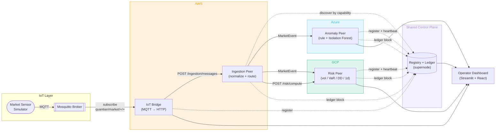

# Blueprint 01 — Presentation View

| Legend Box                  | Value                                              |
|-----------------------------|----------------------------------------------------|
| **Architecture Domain**     | Application                                        |
| **Blueprint Type**          | Executive System Story                             |
| **Scope**                   | Project                                            |
| **Level of Abstraction**    | Presentation                                       |
| **State**                   | To-Be                                              |
| **Communication Objective** | Explain QuantIAN end-to-end in one diagram         |
| **Authors**                 | QuantIAN Team                                      |
| **Revision Date**           | 2026-04-21                                         |
| **Status**                  | Working Draft                                      |

## Narrative (for an evaluator reading this cold)

A simulated sensor publishes market ticks over MQTT. Four independent cloud
services — AWS, Azure, GCP, plus an AWS-resident IoT bridge — find each other
through a shared registry, cooperate on the tick, and record every cross-peer
action on an append-only audit ledger. A dashboard summarizes the whole thing.

## Diagram

## What the evaluator should take away

1. **Four required course pillars** are visible on this single diagram:
   Multi-cloud PaaS (AWS / Azure / GCP), ML (anomaly peer), IoT (MQTT sensor
   stream), P2P + blockchain (registry + audit ledger).
2. **No service talks to another by hardcoded URL.** The dotted lines to the
   registry represent the runtime discovery that enables every solid arrow.
3. **Every solid arrow also leaves a footprint on the ledger.** That's what
   makes QuantIAN's audit story real rather than theatrical.
