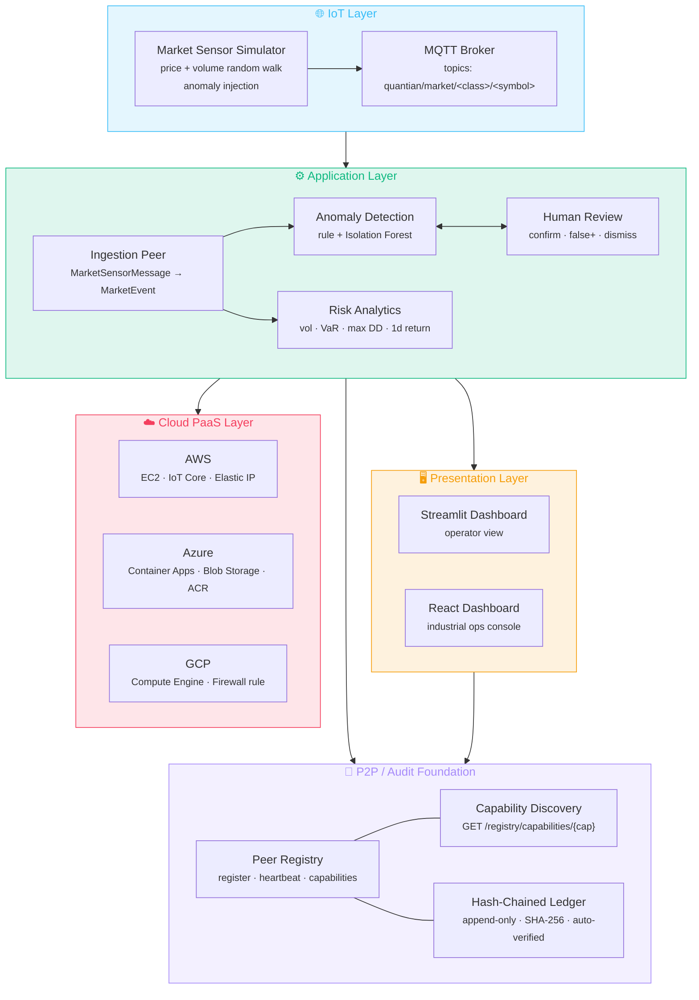

# Blueprint 02 — Conceptual View

| Legend Box                  | Value                                                |
|-----------------------------|------------------------------------------------------|
| **Architecture Domain**     | Application                                          |
| **Blueprint Type**          | Component Relationship Diagram                       |
| **Scope**                   | Project                                              |
| **Level of Abstraction**    | Conceptual                                           |
| **State**                   | To-Be                                                |
| **Communication Objective** | Bounded components and the responsibilities each one owns |
| **Authors**                 | QuantIAN Team                                        |
| **Revision Date**           | 2026-04-21                                           |
| **Status**                  | Working Draft                                        |

## Diagram

## Bounded components

| Component              | Owns                                                  | Reference |
|------------------------|-------------------------------------------------------|-----------|
| Market Sensor          | synthetic ticks with anomaly injection                | [simulator/mqtt_publisher/](../../simulator/mqtt_publisher/) |
| MQTT Broker            | durable topic bus                                     | Mosquitto (eclipse-mosquitto) |
| Peer Registry          | peers list + capability index + heartbeat TTL        | [registry_service/](../../registry_service/) |
| Capability Discovery   | "who can do X?" lookup                               | [registry_service/main.py](../../registry_service/main.py) |
| Hash-Chained Ledger    | append-only tamper-evident log + auto-verification    | [registry_service/store.py](../../registry_service/store.py) |
| Ingestion Peer         | normalize raw ticks + route by capability             | [aws_ingestion/](../../aws_ingestion/) |
| Anomaly Detection      | rule-based + Isolation Forest scoring                 | [azure_anomaly/service.py](../../azure_anomaly/service.py) |
| Risk Analytics         | portfolio vol / VaR / max drawdown / rolling return   | [gcp_risk/service.py](../../gcp_risk/service.py) |
| Human Review           | alert triage workflow                                 | [azure_anomaly/main.py](../../azure_anomaly/main.py) |
| IoT Bridge             | MQTT → HTTP ingestion adapter                         | [iot/bridge.py](../../iot/bridge.py) |
| Operator Dashboards    | read-only live views over all peers                   | [dashboard/app.py](../../dashboard/app.py), [web_dashboard/](../../web_dashboard/) |
