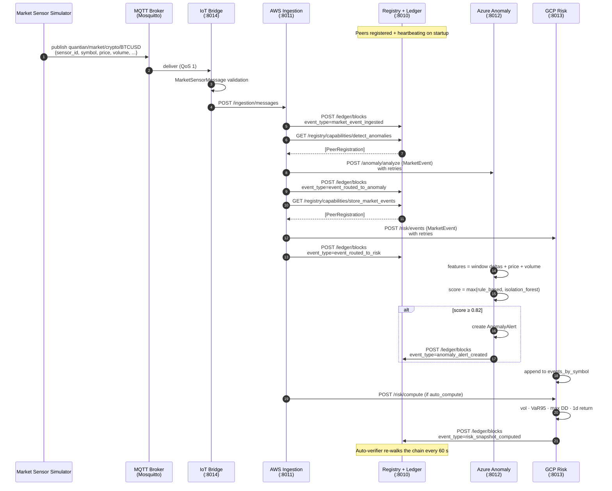
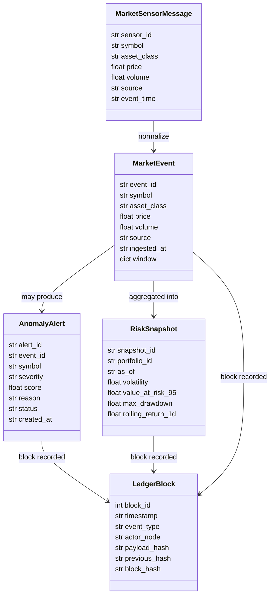

# Blueprint 03 — Logical View

| Legend Box                  | Value                                                           |
|-----------------------------|-----------------------------------------------------------------|
| **Architecture Domain**     | Application + Data                                              |
| **Blueprint Type**          | Service Interaction / Information Flow Diagram                  |
| **Scope**                   | Project                                                         |
| **Level of Abstraction**    | Logical                                                         |
| **State**                   | To-Be                                                           |
| **Communication Objective** | Concrete endpoints, schemas, and the tick-to-ledger lifecycle   |
| **Authors**                 | QuantIAN Team                                                   |
| **Revision Date**           | 2026-04-21                                                      |
| **Status**                  | Working Draft                                                   |

## Service-level sequence

## Capability map

| Capability                 | Declared by      | Consumed by       |
|----------------------------|------------------|-------------------|
| `ingest_market_data`       | aws-ingestion-01 | iot-bridge-01     |
| `publish_events`           | aws-ingestion-01 | —                 |
| `collect_edge_telemetry`   | iot-bridge-01    | (operators)       |
| `mqtt_bridge`              | iot-bridge-01    | —                 |
| `detect_anomalies`         | azure-anomaly-01 | aws-ingestion-01  |
| `list_alerts`              | azure-anomaly-01 | operators         |
| `submit_review_feedback`   | azure-anomaly-01 | operators         |
| `compute_risk`             | gcp-risk-01      | aws-ingestion-01  |
| `store_market_events`      | gcp-risk-01      | aws-ingestion-01  |
| `list_risk_history`        | gcp-risk-01      | operators         |

## Data contracts (Pydantic, see [`shared/schemas/models.py`](../../shared/schemas/models.py))

## Endpoint surface at a glance

- Registry / ledger — [`registry_service/main.py`](../../registry_service/main.py)
- AWS Ingestion — [`aws_ingestion/main.py`](../../aws_ingestion/main.py)
- Azure Anomaly — [`azure_anomaly/main.py`](../../azure_anomaly/main.py)
- GCP Risk — [`gcp_risk/main.py`](../../gcp_risk/main.py)
- IoT Bridge — [`iot/main.py`](../../iot/main.py)

Full endpoint list is in the [root README](../../README.md#core-endpoints-reference).
