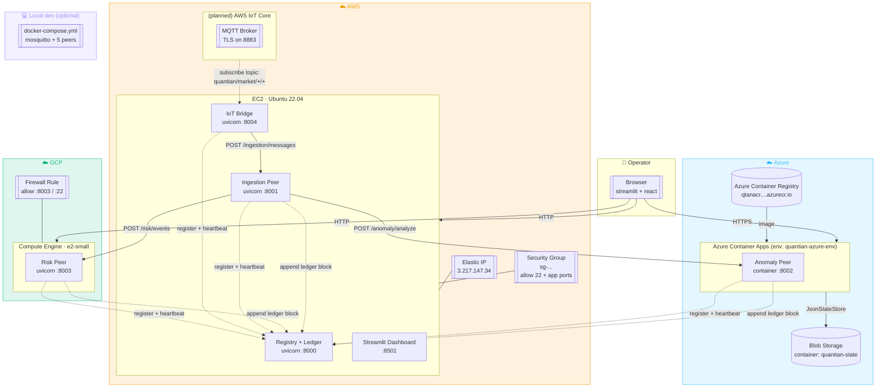
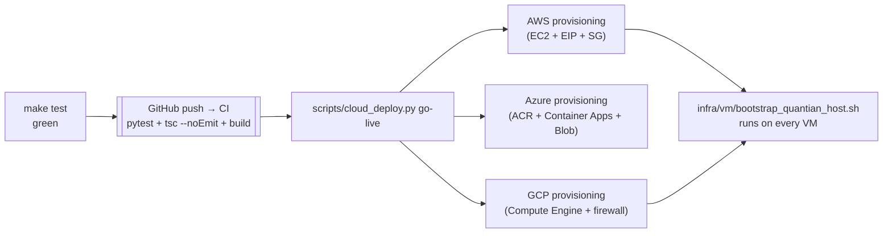

# Blueprint 04 — Physical / Deployment View

| Legend Box                  | Value                                                      |
|-----------------------------|------------------------------------------------------------|
| **Architecture Domain**     | Technical                                                  |
| **Blueprint Type**          | Deployment Diagram                                         |
| **Scope**                   | Project                                                    |
| **Level of Abstraction**    | Physical                                                   |
| **State**                   | As-Is (live) + To-Be (planned hardening)                   |
| **Communication Objective** | Concrete cloud resources that back each logical service    |
| **Authors**                 | QuantIAN Team                                              |
| **Revision Date**           | 2026-04-21                                                 |
| **Status**                  | Working Draft                                              |

## Deployment diagram

## Cloud resource inventory (live)

Pinned from [../LIVE_IMPLEMENTATION_TECHNICAL_DOCUMENT.md](../LIVE_IMPLEMENTATION_TECHNICAL_DOCUMENT.md):

### AWS
| Resource     | Value |
|--------------|-------|
| Region       | us-east-1 |
| Instance     | `i-053e7ea72e9c00e01` (Ubuntu 22.04, t3.small) |
| Elastic IP   | `3.217.147.34` |
| Security grp | `sg-0ebf64ab6b66bd8d5` |
| Services     | Registry, Ingestion, IoT Bridge, Streamlit |

### Azure
| Resource         | Value |
|------------------|-------|
| Resource group   | `quantian-rg` |
| Environment      | `quantian-azure-env` (Container Apps) |
| App              | `quantian-azure-anomaly` |
| Image            | `qtanacr...azurecr.io/quantian/azure-anomaly:20260421053208` |
| Blob storage     | `qtanom...` / container `quantian-state` |
| Endpoint         | `https://quantian-azure-anomaly.yellowocean-36a09ba3.eastus.azurecontainerapps.io` |

### GCP
| Resource | Value |
|----------|-------|
| Project  | `nyu-clopud-hw2` |
| Zone     | `us-central1-a` |
| Instance | `quantian-gcp-risk` (Compute Engine) |
| Public IP | `35.192.123.119` |

## Deployment pipeline

## What's local vs. cloud right now

| Concern              | Local dev                                | Production cloud |
|----------------------|------------------------------------------|------------------|
| Process orchestration | `run_local_stack.py` or `docker compose` | `systemd` (AWS / GCP), Container Apps revision controller (Azure) |
| MQTT broker          | Mosquitto on :1883                       | AWS IoT Core (TLS on :8883) |
| Registry + ledger persistence | `data/runtime/registry_service/*.json` | JSON file on EC2 (can upgrade to DynamoDB) |
| Anomaly persistence  | JSON file                                | Azure Blob Storage (`AzureBlobJsonStateStore`) |
| Risk persistence     | JSON file                                | JSON file on GCE (can upgrade to BigQuery) |
| TLS                  | none                                     | Azure Container Apps terminates TLS; AWS/GCP still plain HTTP (to-do) |
